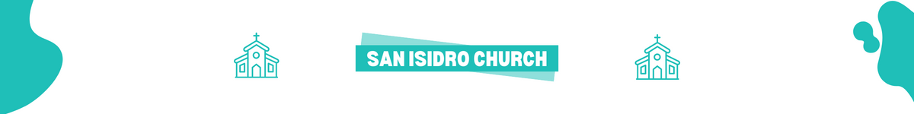

# San Isidro Church
This is a project made for the Web Portals I class. This is the first project that put me on the path of web development using the basic skills and tools to make a web application. This project was made by a team of 6 people led by me.
## Description

This project is a static web page created with HTML, CSS and Javascript. This project shows information about a fictitious church called "Iglesia San Isidro", which contains information about a church, has a fictitious form to make donations, as well as a responsive design to the page. This was our first time creating a website with responsive design, but we managed to overcome this challenge and it resulted in a great user experience, no matter what device the user is on.

## Tech Stack

- ⚙️ HTML
- 🎨 CSS
- ⚙️ Javascript

## Authors

Here are the GitHub profiles of the team members (including me) who made this web app a reality:

- [@thebryanmartinez](https://github.com/thebryanmartinez) 
- [@Archila21](https://github.com/Archila21)
- [@isidroscrumaster69](https://github.com/isidroscrumaster69)
- [@jbjorgebarahona](https://github.com/jbjorgebarahona)
- [@Mando3500673](https://github.com/Mando3500673)
